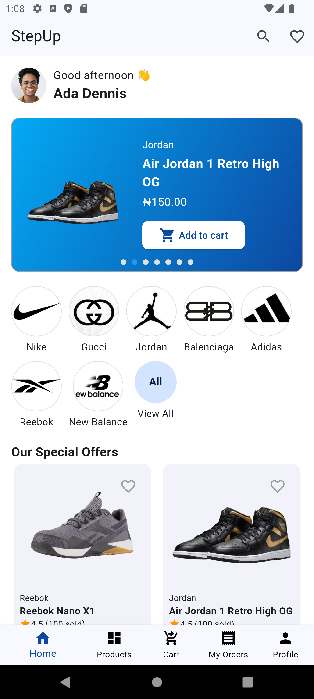
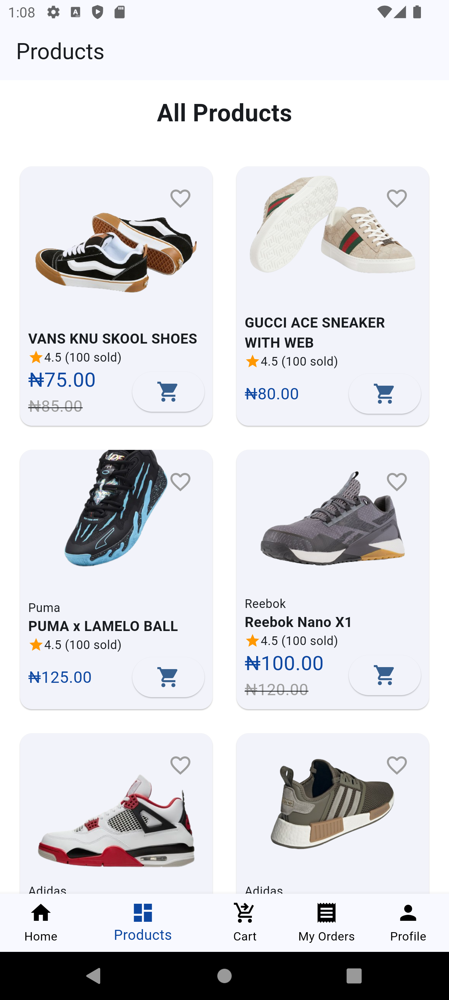
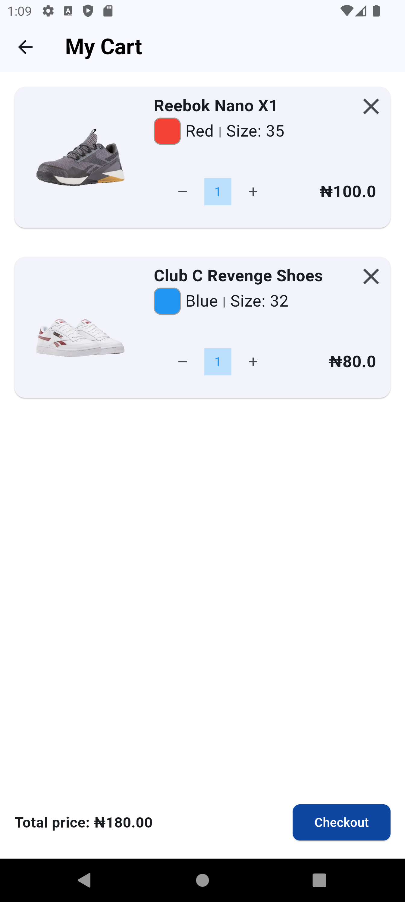
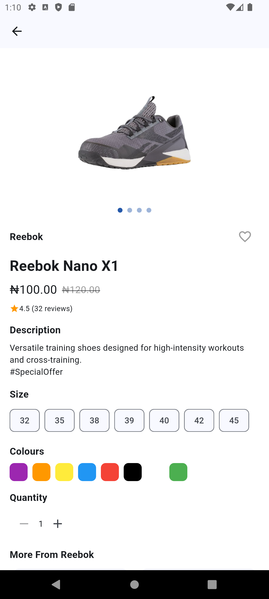
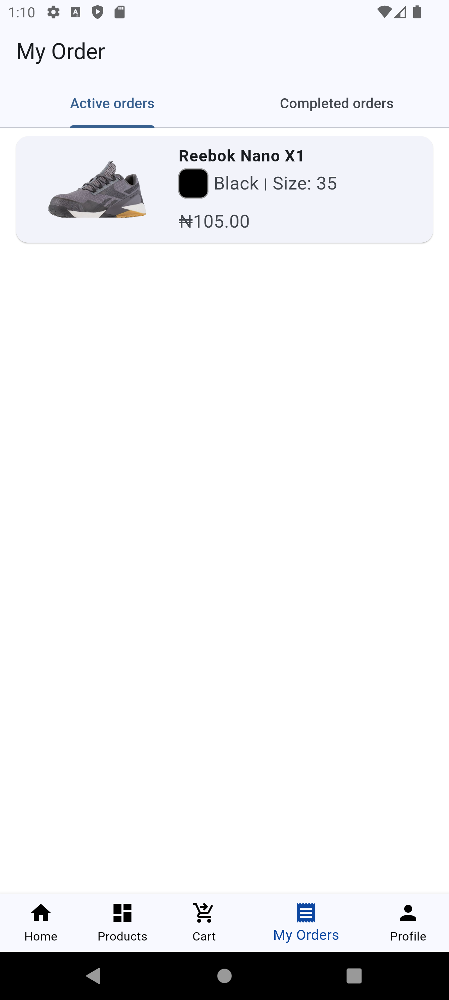
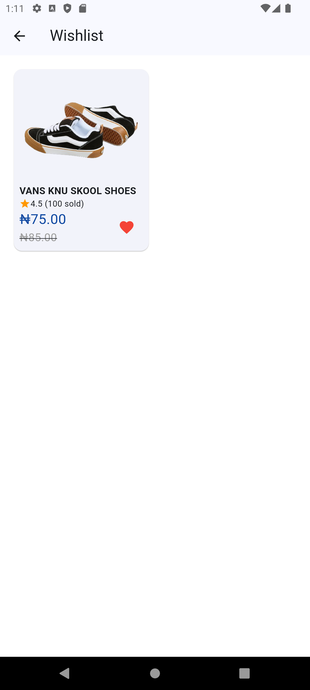
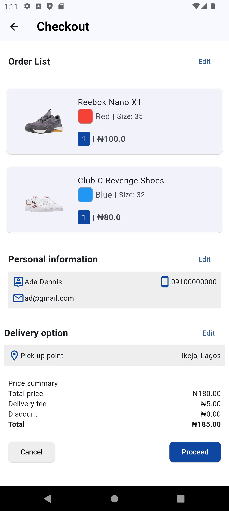
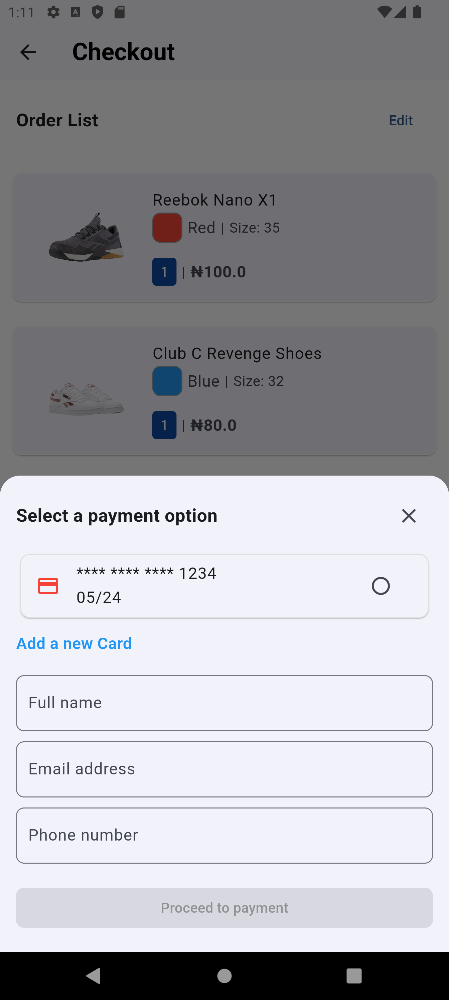
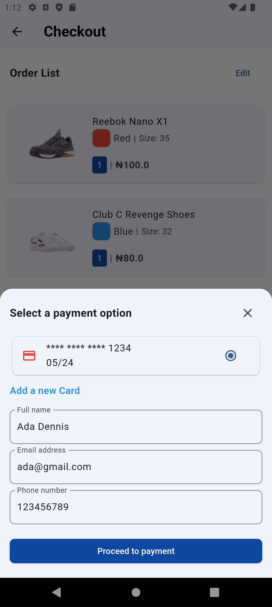
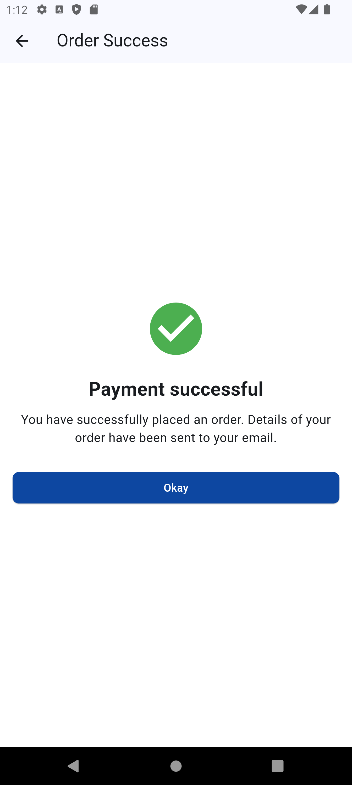

# Task: Add and Complete all Features of your Timbu Shop App.

## Objectives: add and complete features like the ability to add and remove products from cart, checkout the order. a simulated payment flow, order confirmation and an orders history Screen.

# Requirements:
All products must be fetched from the Timbu API. No Placeholder should be found in your app.
Have at least 20 Unique Products in your product list. They should be categorized.
Implement the feature of adding and removing products, wishlist or bookmark, checkout of order e.t.c based on your timbu shop design.
Good shopping experience from start to the completion of an order.
Create an Orders history screen i.e showing all the completed orders made on your timbu shop. Add an icon on your home screen top bar that navigates to the order history screen. Come up with the design if not available.
The Orders history item when clicked must go to a details screen of that order and show details of that order.
The items in the order history screen and details should be cached in a database.
Proper UI state management and handle errors properly.
Fix all noticeable issues.

# Stepup (SaveMart)
Stepup is a continuation of SaveMart. It is a simple sneakers shopping app built with Flutter. It displays a list of products and provides a checkout screen where users can add or remove items from their cart and place orders.

## Features

- Bottom navigation bar with Products and Checkout screens.
- List of products with images, descriptions, and prices.
- Ability to add and remove items from the cart.
- Order success screen.
- User-friendly and intuitive UI.
---------------------------
 **Update**
- Wishlist
- Order History Screen
- Categorized Products etc..
---------------------------

## Screenshots












# Figma Design Link 
[here](https://www.figma.com/design/GkXcZtIpRung91YT7O1LtL/HNG-Tasks?node-id=2591-3319)

## APK Download

Download the APK file for the app [here](https://www.upload-apk.com/WtMLAvbgBaR9Gtx).

## Setup Instructions

Follow these instructions to set up and run the app locally.

### Prerequisites

- Flutter SDK: [Install Flutter](https://flutter.dev/docs/get-started/install)
- An IDE like Android Studio or Visual Studio Code with Flutter and Dart plugins.

### Installation

1. **Clone the repository:**

   ```bash
   git clone https://github.com/cruso003/StepUp.git
   cd StepUp
   cd save_mart
   ```
2. **Get the dependencies:**

```bash
flutter pub get
```
**Run the app:**

```bash
flutter run
```
**Building the APK**
To build the APK, run the following command:

```bash
flutter build apk
```
The APK file will be generated in the build/app/outputs/flutter-apk/ directory.

**Appetize.io Showcase**
You can try the app virtually via Appetize.io [here](https://appetize.io/app/b_sxyowiofdiytewn3t4bkldj34e).